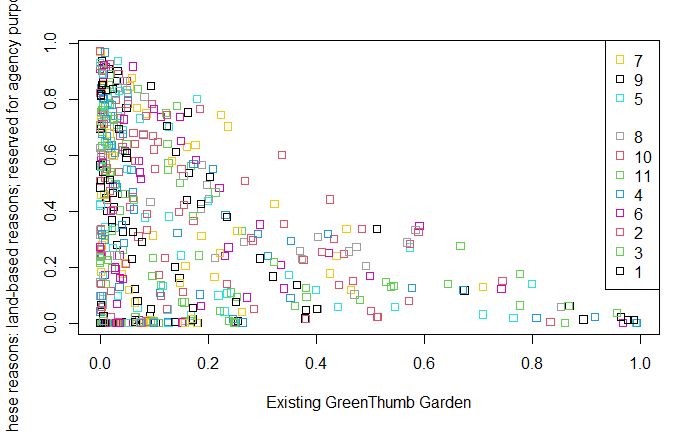

**City Urban Agriculture in New York**

By Jefferson Bourguignon Coutinho

Project Advisor DR. Elena Braynova

### Abstract:

This project is aimed at analyzing the data from the [New York Suitability of City-Owned and Leased Property for Urban Agriculture] ([https://data.world/city-of-ny/4e2n-s75z/workspace/data-dictionary](https://data.world/city-of-ny/4e2n-s75z/workspace/data-dictionary)). This data contained a great number of variables with a diverse variety of measurements in many scales as well as nominal groups. Some of the nominal variables had to many distinct values that would yield a better result if they were stratified further. My first question was a classification question, what is the likelihood of a city urban agriculture site per borough in New York city? The second question and third question required regression. Can we predict the price assessment of property in New York based on residential floor area? And are exemptions distributed fairly or does the rate of change of exemptions and assessment vary and how?

### Introduction

_**This project&#39;s aim is to analyze the data from the [** __**New York Suitability of City-Owned and Leased Property for Urban Agriculture**__ **] (https://data.world/city-of-ny/4e2n-s75z/workspace/data-dictionary). This data contained a great number of variables with a diverse variety of measurements in many scales as well as nominal groups. Some of the nominal variables had to many distinct values that would yield a better result if they were grouped further. My first question was a classification question, what is the likelihood of a city urban agriculture site per borough in New York city? The second question and third question required regression. Can we predict the price assessment of property in New York based on residential floor area? Are exemptions distributed fairly or does the rate of change of exemptions and assessment vary greatly and how**__?_ It turns out that some answers were just what I would have expected. The question on urban-farming-grounds was interesting, I had no expectation to see a pattern or distribution because the data only encompasses a city and the size constrain made me thing the data would be leveled.

### Dataset

This dataset contains 69,533 observations of 77 variables of which 35 are integer over 25 are nominal and almost 15 are numeric. It is a very large dataset, and it was quite confusing because of the flora of values that didn&#39;t always relate to each other. for now, I have decided to look at all data and cherry-pick as well as clean the data separately. I decided to use some generalization to get a snapshot of what I have. This yielded very good insight on which questions to ask.

### Exploratory Statistics

This is the most important part of the project it would be impossible to extract any meaningful insights from this data without a proper look at the distribution and 5-point statistics. Because the data had varied ranges and the number of variables were high, I decided to use boxplots to stratify the data into range friendly variables.

I could see that Assess.Land, Exempt.Land and Exempt.Tot are organized in a friendly range of values. To my surprise these values share similarities like the scale and relate to each other intimately. This led me to continue stratifying the data further to classify my data into groups of related objects that could be visualized separately.

Further looking into distributions, I found Total.Area to be singled out. I visualize it separately using log transformation because the range would give us a distorted view otherwise.

Here we can see Total.Gross.Area.Structures, Commercial.Floor.Area and Other.Floor.Area. BIN is irrelevant to me because I don&#39;t understand what it stands for. We can see that these distributions are well balanced and probably share the same scale units.

This group is very important, and it can tell us a lot about how the city of New York is arranged. A surprising factor is high volume of Factory.Floor.Area which I didn&#39;t expect in such a big modern city, what I did expect was the high volume of Office.Floor.Area.

These are more fine-grained data; they still look promising but there is a lot of noise. Structure.Completed is probably a date or year value. Post.Code has no good use to me. I felt that I should stop looking into stratifying the data at this layer.

Although these smaller numbers could be used further, I decided to not use them because they held no immediate importance to the questions I wished to ask. Looking at them was important to give me the confidence to dismissed them.

From this bar plot we can see the types of data in the dataset. this dataset probably contains a lot of good data to group. another important aspect of this dataset is that it can generate good geographical analysis, timeseries as well as other classifications and regressions. It was difficult to extract the information at first but once I had explored the data in depth everything started to become gradually easier.

### Machine learning

Once all the exploratory statistics were done my job was to look back and decide which questions to ask. I decided to not start the project with a question because I believed more meaningful ideas would come with more understanding. This allowed me to really see what story the data wanted to tell. I was happy with the results and would recommend this dataset to practice on a variety of data science projects.

### Classification

Because I decided to clean the data at each point separately the classification took some time to be fine-tuned. The formula was part of the decision and cleaning. I had to experiment with different variables to see what type of data would be accepted by the models. Once this problem was overcome the visualization proved to be very informative.

I started by using K nearest neighbor, but I had a lot of trouble with missing values. I still don&#39;t understand what went wrong because I did make sure to eliminate all NAs in the data, so I soon found it was better to not obsess and find a new tool. I started experimenting with naïve bayes and was successful at using it.

==================================================================== Naive Bayes ====================================================================

Call:

naive\_bayes.formula(formula = Borough ~ Open.Petroleum.Spill,

data = df)

-----------------------------------------------------------------------------------------------------------------------------------------------------

Laplace smoothing: 0

-----------------------------------------------------------------------------------------------------------------------------------------------------

A priori probabilities:

| 1 | 2 | 3 | 4 | 5
-
| 0.1176276 | 0.1411991 0.2545698 0.2473214 0.2392821

-----------------------------------------------------------------------------------------------------------------------------------------------------

Tables:

-----------------------------------------------------------------------------------------------------------------------------------------------------

::: Open.Petroleum.Spill (Bernoulli)

-----------------------------------------------------------------------------------------------------------------------------------------------------

Open.Petroleum.Spill 1 2 3 4 5

0.913314586 0.958851090 0.958533416 0.963133105 0.992847698

Yes 0.086685414 0.041148910 0.041466584 0.036866895 0.007152302

This wasn&#39;t the question I asked but it was interesting to see Manhattan as having the greatest probability of having an oil spill. Which contrast with the question I wanted to ask. Apparently, you can&#39;t be best in class at everything.

My question was -what is the likelihood of a city urban agriculture site per borough in New York city? So, I checked whether naïve bayes was a suitable model to use. From all I read so far it is the simplest but most honest and accurate tool for modeling probabilities. To understand the use-land-category the Pluto data dictionary is provided.

The land-use-category is represented by colored squares. NAs are not represented in this data which is why there is a no color no number level in the plot legend. This graph shows the entire city of NY distribution of probabilities for either existing green-thumb-garden or any other case.

The information from the data dictionary below also helps us understand the potential-urban-agriculture-category. For my question all I wanted to know was the existence of one or not.

&quot;• Potentially Suitable 1: Site is available for a 4 year renewable license through the Parks Department GreenThumb program contingent on program capacity.
 • Potentially Suitable 2: Site is available on an interim basis (1 or 2 year license agreements that are potentially renewable) contingent on program capacity.
 • Potentially Suitable 3: Site has specific instructions or conditions that limit its availability and/or use.
 • Not Suitable 1: Site is not suitable for any one or more of these reasons: land-based reasons; reserved for agency purposes; no safe access to the site; site is part of a built street/highway.
 • Not Suitable 2: Site is smaller than 2500 square feet.
 • Pending: GreenThumb Garden designation is pending.
 • Existing GreenThumb Garden: Licensed GreenThumb Garden is currently in operation.&quot; (Data, 2011)

To understand the results better I plotted multiple models filtered by borough to compared them to each other. The plot below represents only Manhattan.

The plot below represents the Bronx. From here we can begin to see the data shift left.

This plot represents Brooklyn. Again, the data continues to shift left.

Here we have Queens. This area drastically shifts left leaving mix residential and commercial building as well as transportation and utility as best candidates.

And last, we have Staten Island. The worst in comparison to every other borough. The land use with greater probability were multifamily walk up building.

To validate the location of boroughs by number I plotted all properties by latitude and longitude grouped by Borough to cross reference the locations with a map.

 

It is not surprising that a borough would be doing better than another. If anything, I would expect that there is always going to be a difference. But values such as these are essential for benchmark and continuous improvement.

### Regression

I decided to look at the price assessment of land, total exemption, and the residential floor area. I thought these variables could have interesting relationships and shared a continuous value structure.

The last plot did not show a useful relationship on any of the combinations that take residential floor area. I eliminated the zero values and now the distribution is starting to show promise. A possible reason for the flattening on the axis is that not every use case is residential, so any other use case would mean residential floor area would be zero. That does not mean that assessment and exemptions will at the same time be zero. So residential floor area could be zero and at the same time have a value for assessment and exemption. I concluded that zeroes in the residential floor area are nonexistent values and that these values are already represented by other use area values.

The model yielded a 0.72 R-squared value which gives me some confidence that the model shows relatively good results. The T values of 33 and 2 gives us the P values for the T test which are 0.0000000000000002 for Exemptions, extremely close to zero, and 0.02 for residential floor area. Both are under 0.05 which gives us the confidence that the predictor has a statistically significant relationship with the response variable.

After running this plot, I realize that my model fit well overall.

Does residential floor area influence price of land predicted and observed? There is a group under 50 million dollars under 2 million units. The residential floor area at 4 million units has values in the range of 80 to 150 million dollars.

Are exemptions fair? No, under 50 million dollars land assessment exemption values spike sharply and erratically. Then climbs to 100 million dollars at a much greater rate than land value.

After removing the zeroes, I removed three extreme values that were skewing the data

This reduced my R-Squared value to 0.64 which was unexpected. It gave me a more spread-out distribution and I was interested in what ways the results would change.

The linear model plot shows that the points are more diverse and less fitted.

The gain curve also lost cohesion at higher values which corroborates the linear regression.

As suggested by the gain plot and squared error our prediction is a little less precise but at this level it appears that area does not dictate price. This can be seeing more easily here than before removing the outliers.

It confirms one of my beliefs that the more money you have the more you save conversely the less money you have the more you pay. The sharp change in exemptions shows that New York is the city of the rich.

### Conclusion

If modern cities are to grow sustainably new concepts such as urban farming are key to their success. New York should take notes on what Manhattan is doing and apply it to Staten Island. We can predict the land assessment value in New York easily. The residential floor area only affects the assessment at very high values over 2,000,000 units. The total exemptions disproportionally favor land that are more valuable, making it so that one would gradually pay less, the more value assessment amasses.

### References

(DCP), D. o. C. P., n.d. _nyc.gov._ [Online]
 Available at: https://www1.nyc.gov/assets/planning/download/pdf/data-maps/open-data/pluto\_datadictionary.pdf?v=21v4

Coutinho, J. B., 2022. _Data Capstone Final Project._ [Online]
 Available at: https://gitlab.com/jeffersonbourguignon/data-capstone-final-project

Data, N. O., 2011. _NYC Open Data._ [Online]
 Available at: https://data.cityofnewyork.us/City-Government/Suitability-of-City-Owned-and-Leased-Property-for-/4e2n-s75z

GitLab, n.d. s.l.: s.n.

Library, P. U., n.d. _Princeton Univercity Library._ [Online]
 Available at: https://dss.princeton.edu/online\_help/analysis/interpreting\_regression.htm

Python, n.d. s.l.: s.n.

R Studio, n.d. s.l.: s.n.

Statology, n.d. _Statistics Simplified Statology._ [Online]
 Available at: https://www.statology.org/interpret-prt-regression-output-r/

3 **|** Page

## Getting started

This project's aim is to analyze the data from the [New York Suitability of City-Owned and Leased Property for Urban Agriculture](https://data.world/city-of-ny/4e2n-s75z/workspace/data-dictionary)

## License
[Creative Commons v1.0](https://gitlab.com/jeffersonbourguignon/data-capstone-final-project/-/blob/main/LICENSE)
